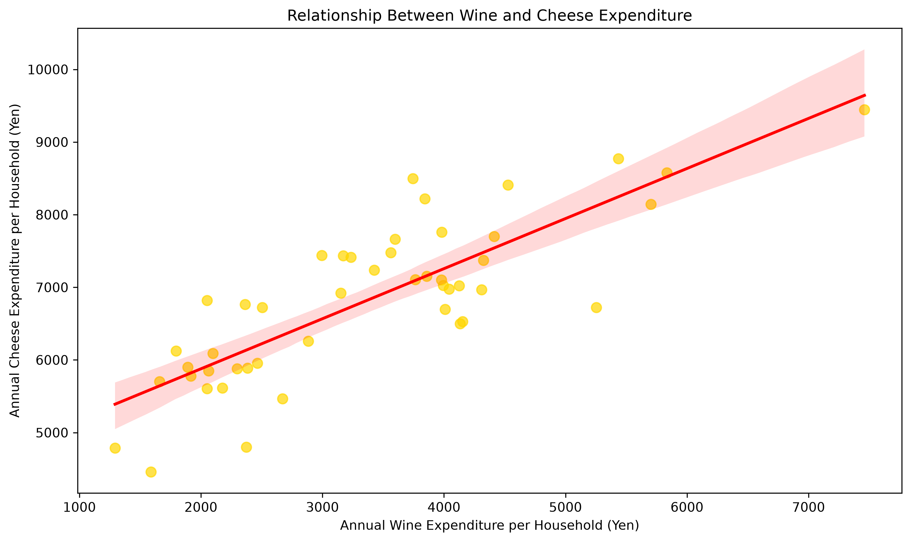

[README.md](https://github.com/user-attachments/files/30151030/README.md)
# 都道府県庁所在市別・チーズ支出額の分析

## 開発について

本プロジェクトは、Pythonと業務自動化の学習を目的に、生成AIのサポートを活用して開発しました。

## 分析の目的

都道府県庁所在市によって、1世帯当たりのチーズ年間支出額にどの程度の差があるのかを調べました。また、チーズと一緒に購入されるイメージがあるワインについて、支出額同士に関係があるのかを分析しました。

## 使用データ

独立行政法人統計センターの「SSDSE-家計消費（SSDSE-C-2026）」を使用しました。

このデータには、全国および47都道府県庁所在市における、二人以上世帯の品目別年間支出金額が収録されています。数値は2023年から2025年までの平均値です。

## チーズとワインの関係

チーズとワインの年間支出額の相関係数は0.82となり、強い正の相関が確認されました。このことから、ワインへの支出が多い都市では、チーズへの支出も多い傾向があると考えられます。

一方、熊本市はワイン支出額に比べてチーズ支出額が少なく、長野市は反対にチーズ支出額が多いという特徴がありました。地域固有の食文化や購入習慣などが影響している可能性があります。

ただし、相関関係だけでは、ワインへの支出がチーズへの支出を増やしているとは断定できません。
